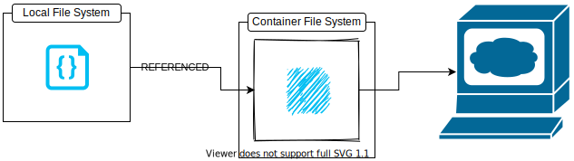

### How to Containerize a Javascript Application
This section introduces to **volumes and multi-staged builds**, two of the most concepts in Docker.

### Writing the development Dockerfile
Let's plan on what and how our app should run by enumerating :
    - Get a good image by running JavaScript applications like **Node**
    - Set the default working directory inside the image
    - copy the <code>package.json</code> file into the image
    - Install necessary dependancy
    - Copy the rest of the project files
    - Start the <code>vite</code> development server by executing <code>npm run dev</code>  command

Our <code>Dockerfile.dev</code> having the above plan should then look like:
```
FROM node:lts-alpine

EXPOSE 3000

USER node

RUN mkdir -p /home/node/app 

WORKDIR /home/node/app  #set the default working directory

COPY ./package.json .
RUN npm install

COPY . .

CMD [ "npm", "run", "dev" ]
```
The <code>FORM</code> instruction sets the the official Node.js image as the base giving us all the goodness of Node .js necessary to run any JavaScript application.

The <code>lts-alpine</code> indicate that we want to use the Alpine variant, long term support version of the image.

The <code>USER</code> instruction sets the default user for the image to <code>node</code>. By default Docker run container as the root user. But according to Docker and Node.js best practice, this can pose a security threat. So it better to run a non-root user whenever possible. The node image comes with a non-root user named <code>node</code> whoch we can set as the default user using the <code>USER</code> instruction.

<code>WORKDIR</code> set the default directory to the specified with this instruction. By default the working image of any image is the root, but we don't want unecessary files sprayed all over our root directory. The working directory will be applicable to any subsequent <code>COPY</code>, <code>ADD</code>, <code>RUN</code> and <code>CMD</code> instructions.

The second <code>COPY</code> instruction copies the rest of the content from the current directory (<code>.</code>) of the host filesystem to the working directory (<code>.</code>) inside the image.

Finally, the <code>CMD</code> instruction here sets the default command for this image which is <code>npm run dev</code> written in <code>exec</code> form.

The <code>vite</code> development server by default runs on port <code>3000</code> , and adding an <code>EXPOSE</code> command seemed like a good idea, so there you go.

To build an image from our Dockerfile we'll use the command below:
```
docker image build --file Dockerfile.dev --tag hello-dock:dev .
```
Given the filename is not a <code>Dockerfile</code>, we have to explicitly pass the filename using the <code>--file</code> option. 
Let's execute the following commad to run a container using the iamge we just created.
```
docker container run --rm --detach --publish 3000:3000 --name hello-dock-dev hello-dock:dev 
```
What we did is okay but there is one big issue with it and a few places to be improved.

### Working with Bind Mounts in Docker

Normally, the development features in JS Framework usually come with a hot reload i.e the server reload and reflect each change made locally immediately.
Unfortunately, docker is not working that way because the server is running in a container and changes are made locally.


TO solve that issue we can make use of bind mounts, using so, we can easily mount one of our local file system directory inside a container. Instead of making a whole other copy of the local syste, the bind mount can reference the local file system directly inside a container.



This way the hot reload can work as a charm and with any change made locally the server will immediately reflect them.
As seen in part I, bind mounts are achieved by using the <code>--volume</code> or <code>-v</code> option for the <code>container run</code> or <code>container start</code> commands.
```
--volume <local file system directory absolute path>:<container file system directory absolute path>:<read write access>
```
Let's apply bind mounts to our vite js app
```
docker container run --rm --publish 3000:3000 --name hello-dock-dev --volume $(pwd):/home/node/app hello-dock:dev
```
Although the usage of volume solve the issue of hot reloads, it introduces another problem. 
While the dependancies of a node project live inside the <code>nodes_modules</code> directory on the project root.

```
docker container run --rm --publish 3000:3000 --name hello-dock-dev --volume $(pwd):/home/node/app hello-dock:dev

> hello-dock@0.0.0 dev /home/node/app
> vite

sh: vite: not found
npm ERR! code ELIFECYCLE
npm ERR! syscall spawn
npm ERR! file sh
npm ERR! errno ENOENT
npm ERR! hello-dock@0.0.0 dev: `vite`
npm ERR! spawn ENOENT
npm ERR! 
npm ERR! Failed at the hello-dock@0.0.0 dev script.
npm ERR! This is probably not a problem with npm. There is likely additional logging output above.
npm WARN Local package.json exists, but node_modules missing, did you mean to install?

npm ERR! A complete log of this run can be found in:
npm ERR!     /home/node/.npm/_logs/2021-07-05T03_24_54_158Z-debug.log
```
After we mount the project root on our local file system as a volume inside the container, the content inside the container gets replaced along with the <code>node_modules</code> directory containing all the dependencies. This means that the vite package has gone missing.

### Working with Anonymous Volume in Docker
To solve the above problem we use **anonymous volume**. An anonymous volume is identical to a bind mount except that we don't need to specify the source directory.
The generic syntax is as follow
```
--volume <container file system directory absolute path>:<read write access>
```
The final command for starting the <code>hello-dock</code> container is as follow:
```
docker container run --rm --detach --publish 3000:3000 --name hello-dock-dev --volume $(pwd):/home/app/node --volume /home/node/app/node_modules hello-dock:dev
7546a5587d28a1d2b47bfe3ad53da10e24a1fcb9504dcc6740eb071626d5fe21
```
Here, Docker will take the entire <code>node_modules</code> directory from inside the container and tuck it away in some other directory managed by the Docker daemon on our host file system and will mount that directory as node_modules inside the container.

#Performing a Multi-Stages build in docker
The image we've built so far was in a development mode. To build one in a production mode, we gon have to face some challenges.

In production mode, the <code>npm run build</code> compile all the JS code to HTML/CSS a JS files. No other runtinme is needed to run those files but a server like <code>apache</code> or <code>nginx</code>

We may take the following step to create an image to be run in a production mode:
 * Using node as the base image to build the application
 * Install nginx inside the node image and use that to serve the static files.
One problem here is that the node image to too heavy and most of the stuff in there aren't needed for the static genereated files.
A best approach is :
 * Use node image as the base and build the application.
 * Copy the files created using the node image to an nginx image.
 * Create the final image based on nginx and discard all node related stuff.
This way the image contains only what needed and become very handy.
This approach is a <code>multi-staged build</code>.
To perform a such build, we create a Dockerfile as follow:
```
FROM node:lts-alpine as builder ## First stage of the build using node:lts-alpine as the base image, this stage is assigned with as builder

WORKDIR /app

COPY ./package.json ./
RUN npm install

COPY . .
RUN npm run build

FROM nginx:stable-alpine ## second stage of the build using nginx:stable-alpine as the base image

EXPOSE 80  ## nginx server runs at port 80 by default

COPY --from=builder /app/dist /usr/share/nginx/html 
```
* The last line is a <code>COPY</code> instruction. The <code>--from=builder</code> part indicates that you want to copy some files from the <code>builder stage</code>. After that it's a standard copy instruction where <code>/app/dist</code> is the source and <code>/usr/share/nginx/html</code> is the destination. The destination used here is the default site path for <code>NGINX</code> so any static file you put inside there will be automatically served.
Let's run our new container by executing the following command:
```
docker container run --rm --detach --name hello-dock-prod --publish 8080:80 hello-dock:prod 
```
Multi-staged builds can be very useful when building large applications with a lot dependancies. If configured properly, images built in multiple stages can be very optimized and compact.

## Ignore unnecessary files
With <code>.dockerignore</code> files and directories can be ignored and/or excluded from the image builds. The <code>.dockerignore</code> file contains a list of files and directories to be ignored. Docker uses the same concept as <code>.git</code>. Example of the content of such file:

```
*Dockerfile
.git
*docker-compse*
node_modules
```
The <code>.dockerignore</code> has to be in the build context. Files and directories mentionned here will be ignored by the <code>COPY</code> instruction. When using a bind mount, the <code>.dockerignorefile</code> won't have any effect.


